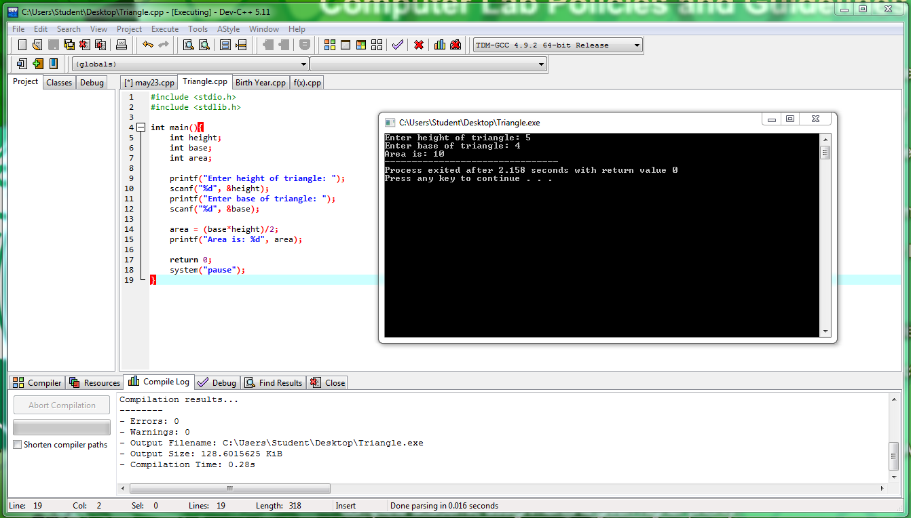
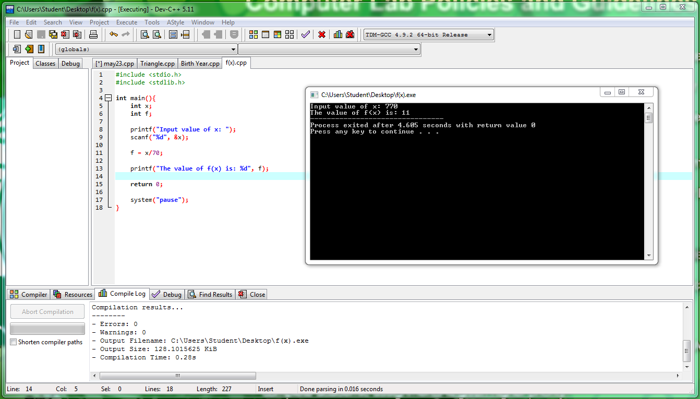

# Activity1-GamboaT

int main ()
{
printf("@@@@@@@@@@@@@@@@@@@@@@@@@@@@@@@@@@@@@@@\n\n\tTiffani Grace V. Gamboa\n\tBS IME-IT\n\t11414081\n\tJune 3, 1997\n\ttiffani_gamboa@dlsu.edu.ph\n\n@@@@@@@@@@@@@@@@@@@@@@@@@@@@@@@@@@@@@@@");
}

