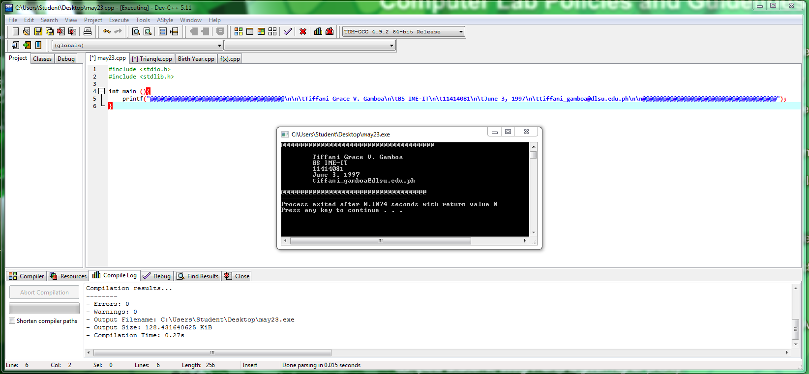

# Activity1-GamboaT

int main ()
{
printf("@@@@@@@@@@@@@@@@@@@@@@@@@@@@@@@@@@@@@@@\n\n\tTiffani Grace V. Gamboa\n\tBS IME-IT\n\t11414081\n\tJune 3, 1997\n\ttiffani_gamboa@dlsu.edu.ph\n\n@@@@@@@@@@@@@@@@@@@@@@@@@@@@@@@@@@@@@@@");
}

int main()
{
	int height;
	int base;
	int area;
	
	printf("Enter height of triangle: ");
	scanf("%d", &height);
	printf("Enter base of triangle: ");
	scanf("%d", &base);
	
	area = (base*height)/2;
	printf("Area is: %d", area);
	
	return 0;
	system("pause");
}

#include <stdio.h>
#include <stdlib.h>

int main()
{
	int b;
	int a;
	
	printf("Enter birth year: ");
	scanf("%d", &b);
	
	a = 2016 - b;
	
	printf("Approximate Age: %d", a);
	
	return 0;
	
	system("pause");
}

